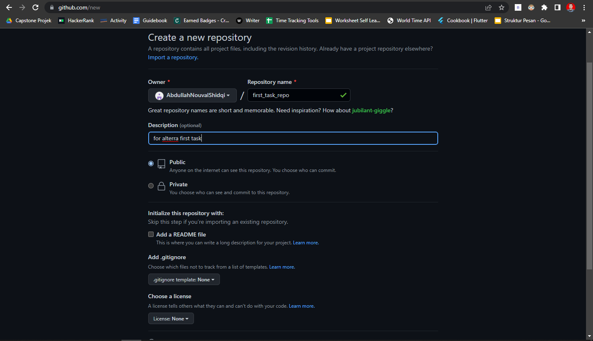
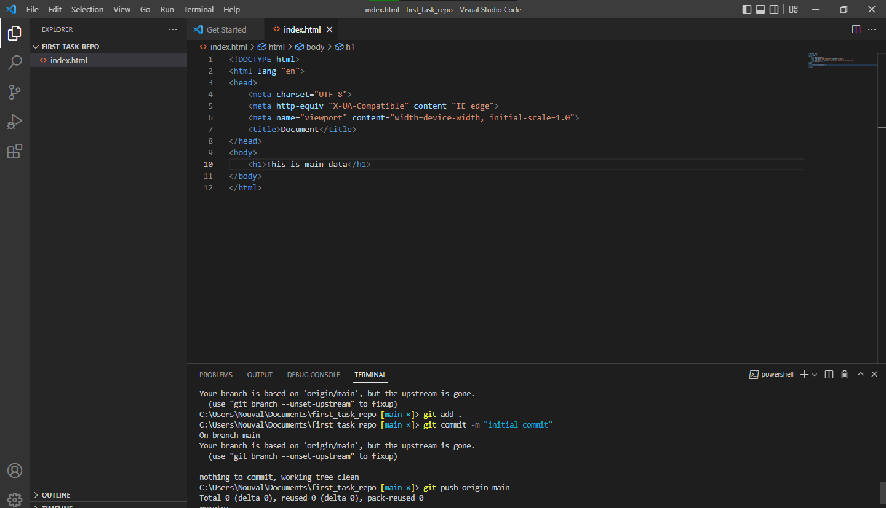
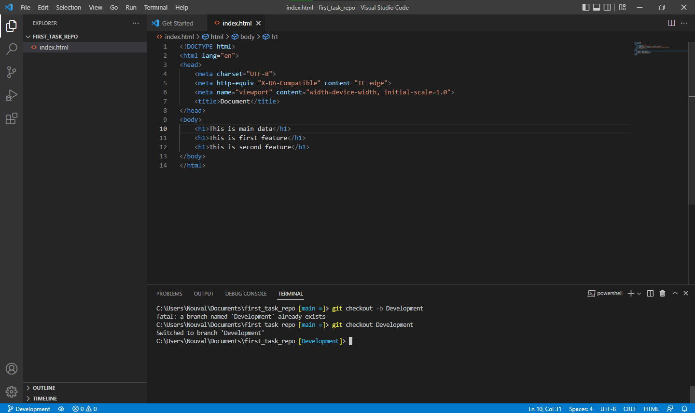
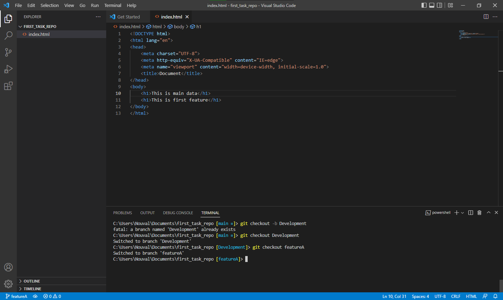
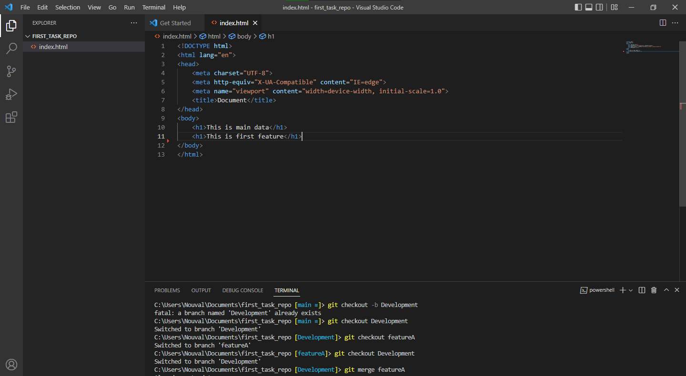
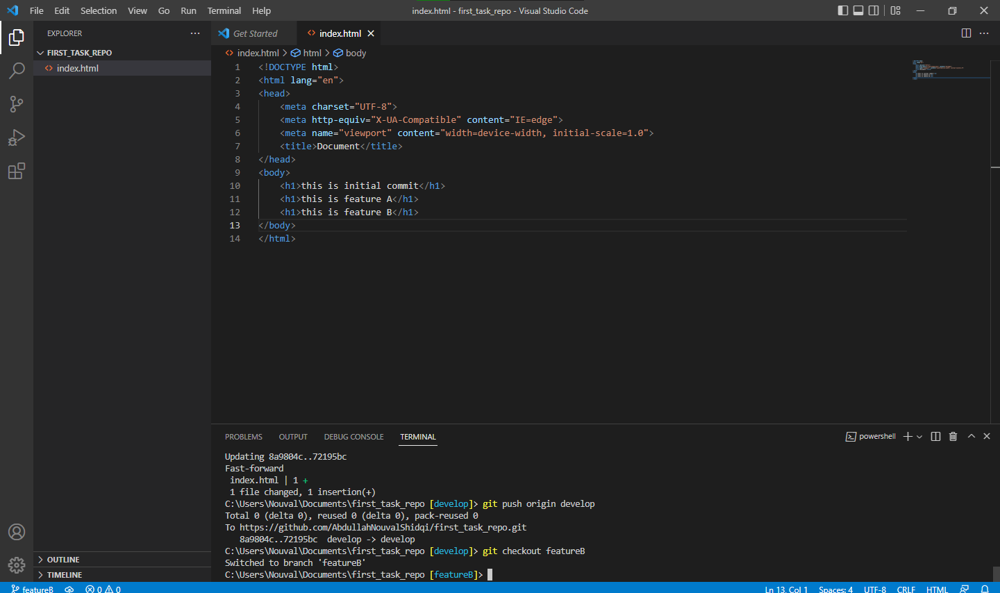
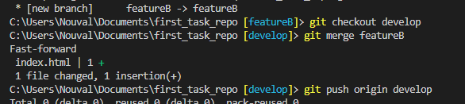
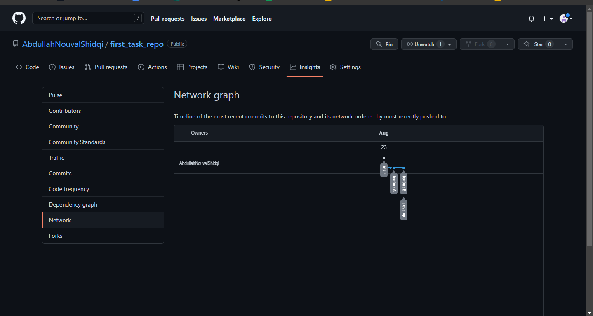

# Basic Version and Branch Management (Git)
## Resume
Dalam materi ini saya mempelajari:
1. Penjelasan dari Git
2. Fungsi dan keuntungan dari Git
3. GitHub sebagai layanan host Git

### 1. Penjelasan Git
Git itu adalah sebuah perangkat lunak yang dibuat untuk mengendalikan atau mengatur versi dari source code, tanpa version control, pengerjaan akan dikerjakan(sebagai misal) kita mengerjakan sebuah dokumen, dan pada saat sesudah dilakukan revisi maka dokumen akan di save dengan nama dokumen yang berbeda secara terus menerus sampai pada akhirnya sampai ke penamaan akhir, dapat dikatakan bahwa metode ini sangat tidak efisien, jadi dengan adanya version control maka, akan seperti dimana sebuah dokumen sesudah direvisi maka akan di save dengan penamaan file yang sama, tapi dengan adanya version control, kita dapat melihat history dari bagian mana saja yang diubah dan dapat meload kembali dari apa yang sudah buat pada sebelumnya, sehingga pekerjaan jauh lebih efisien dan irit tempat karena tidak perlu menaruh dokumen dengan penamaan yang berbeda.

### 2. Fungsi dan keuntungan Git
Git ini merupakan salah satu version control system populer yang digunakan para developer untuk mengembangkan software secara bersama-sama, karena git memiliki kemampuan untuk men-track segala perubahan pada file projek yang sedang dikerjakan, dan jika misalnya ada kesalahan maka dapat dikembalikan, bahkan langsung diubah secara bersama-sama.

### 3. GitHub
Ada tempat kita untuk menyimpan repository ini yaitu pada GitHub git hosting service, dalam penggunaan git juga sebenarnya tidak terlalu susah, mulai dari melakukan instalasi hanya cukup download installer dan melakukan sedikit config pada git bash, kita dapat mem push projek pada file kita, untuk di upload ke github, ataupun melakukan pull projek pada github sehingga kita akan memiliki file yang sama pada projek pada file lokal, untuk melakukan push dimulai dengan git add <directory>, untuk memilih folder/file yang ingin di push, lalu melakukan commit sebagai record dan juga message untuk apa yang berubah, misal “Adding Readme” ketika sesudah menambahkan readme pada github. Dan juga ada fungsi git log –oneline untuk melihat semua versi pada bagian commit, dimana kita bisa kembali kepada saat tersebut dengan melakukan perintah git checkout <kode_unik>, bahkan bisa kita benar-benar reset sehingga kembali pada versi sebelumnya ataupun secara soft sehingga git tidak akan merubah file dan index pada directory berjalan. Ada juga branch, workflow, sehingga kita bisa melakukan kerja dengan aman dan mudah bahkan efisien.

## Task
### Membuat sebuah repository baru di github
Dapat dilihat link repo baru yang sudah dibuat [disini](https://github.com/AbdullahNouvalShidqi/first_task_repo)  
Dan juga ada berikut ini merupakan screenshot dari bukti saya pembuatan dari repo baru yang saya buat.  
  

### Memasukkan projek bebas dan membuat projek tersebut sebagai master
Pada foto berikut dapat dilihat saya membuat sebuah file html simple dan di push pada brach main di github.  
  

### Membuat brach untuk melakukan development
Dapat dilihat pada foto berikut bahwa saya telah membuat sebuah branch dengan nama Development.  

### Buatlah branch ketiga sebagai penambah fitur, pada branch ini lakukan penambahan fitur. Lakukan merge pada branch tiga kedalam branch develop
Dapat dilihat pada foto berikut saya menambah branch baru lalu menambah sedikit line pada kodingan bahwa ini fitur ke satu pada branch feature A, dan melakukan merge ke branch development.  
1. Berikut untuk isi dari feature A.  
  
2. Berikut sudah memasukkan feature A ke Branch development.  
   

### Buatlah branch keempat sebagai penambah fitur, pada branch ini lakukan penambahan fitur. Lakukan merge pada branch tiga kedalam branch develop
Dapat dilihat pada foto berikut saya menambahkan branch bernama feature b sebagai brach keempat dan menambahkan sedikit line kepada kodingan lalu di merge juga ke development.  
1. Berikut untuk isi dari feature A.  
  
2. Berikut sudah memasukkan feature A ke Branch development.  
   

### Buktikan dari screenshot dari insight=>network. Kumpulkan SS dan juga link dari repo kalian pada alta.id
Bukti foto insight.  
  