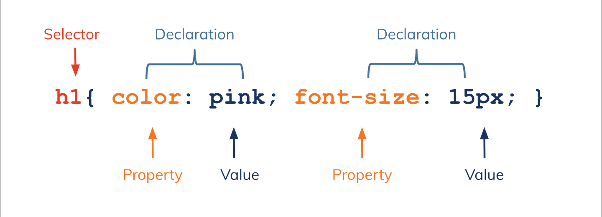

# 6 CSS
## Resume
Dalam materi ini, saya mempelajari:
1. Apa itu CSS.
2. Cara menambahkan file CSS ke HTML.
3. Syntax pada CSS.
4. Apa itu Frontend Framwork.

### 1. Apa itu CSS
CSS (Cascading Style Sheets), yang berfungsi untuk menghias website, dimana kita bisa mengubah font, ukuran, warna maupun melakukan layouting dengan cara mengubah posisi atau tata letak dari elemen html yang telah kita buat, dimana dengan menggunakan CSS ini kita bisa membuat tampilan website yang kita buat menjadi lebih menarik.

### 2. Cara menambahkan file CSS ke HTML.
Cara nya ada 3, yaitu dengan cara External CSS, Internal CSS, dan Inline CSS.  
Cara external CSS adalah dengan membuat sebuah file bertipe css atau dapat digambarkan dengan nama_file.css, untuk menambahkan atau import css kedalam file html, bisa dengan cara menambahkan tag link pada bagian head di html, sebagai contoh **<link href="style.css" rel="stylesheet">**  *File taruh di dalam folder yang sama dengan file html yang melakukan import dengan tag link.  
Lalu ada cara kedua yaitu dengan cara internal CSS, yang kita lakukan untuk melakukan internal CSS adalah dengan menambahkan tag style pada html, dimana didalam tag style tersebut kita bisa menambahakn code line CSS yang kita butuhkan. Contoh kita bisa mengganti warna background dengan line code: **"<syle>html{backgound-color: green;}</style>"** pada HTML.  
Lalu ada cara terakhir yaitu dengan cara inline styling, cara mengaplikasikannya adalah dengan menambahkan atribut style pada tag dan komponen yang akan kita ubah tampilannya, contoh **"
Test
"**, disini kita gunakan untuk mengubah warna font menjadi merah.

### 3. Syntax pada CSS
Untuk syntax pada css dapat dilihat pada gambar berikut.  
  

Dapat dilihat pada gambar dimana h1 merupakan selector, dimana selector disini kita gunakan untuk memilih elemen HTML mana yang ingin kita ubah tampilannya, dimana didalamnya terdapat property-property yamg kita butuhkan untuk mengubah tampilan, dan value untuk menentukan kebutuhan ukuran dari ubahan yang kita lakukan pada elemen yang telah kita pilih.  

Lalu pada CSS juga ada penanda, dimana kita menandakannya dengan class dan id, dimana id disini memiliki ciri khas dimana setiap elemen hanya dapat memiliki 1 id tag, dan dalam satu halaman tidak boleh ada 2 penamaan id berbeda. Lalu untuk class sendiri nama nya dapat diulang-ulang, dan satu elemen boleh memiliki lebih dari satu class yang berbeda.

### 4. Apa itu Frontend Framwork.
Frontend Framework adalah sekumpulan aturan kode yang bisa kita gunakan untuk mempermudah dalam membuat suatu tampilan website. Contoh framework yang sering digunakan diantara lain Bootstrap, Semantic UI, Motion UI, Material UI dan framework lainnya. Kebanyakan orang menggunakan Bootstrap, dengan alasan gratis, mudah dipelajari, cepat dan mendukung responsif.