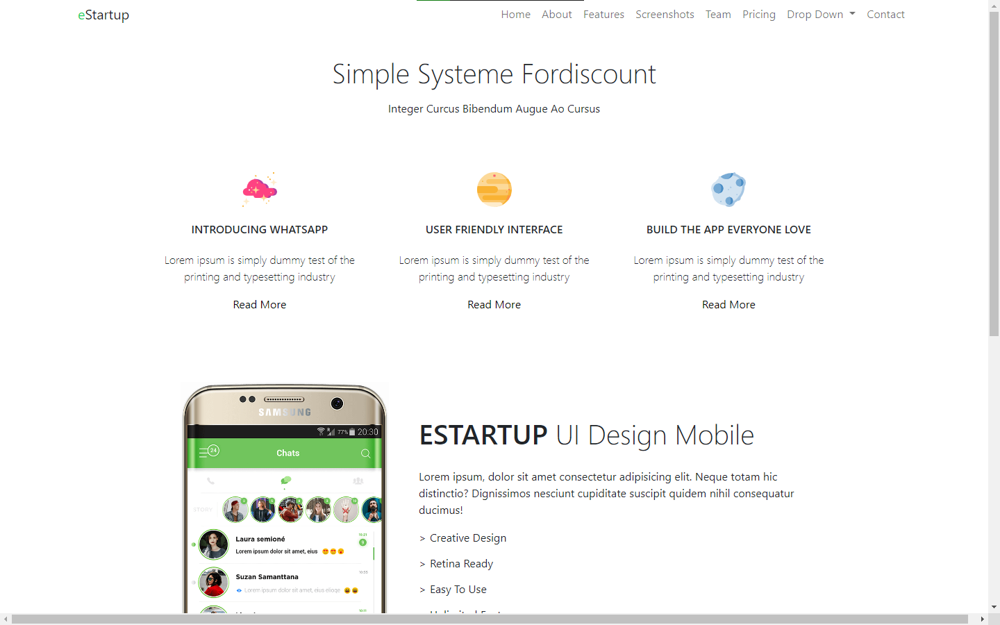
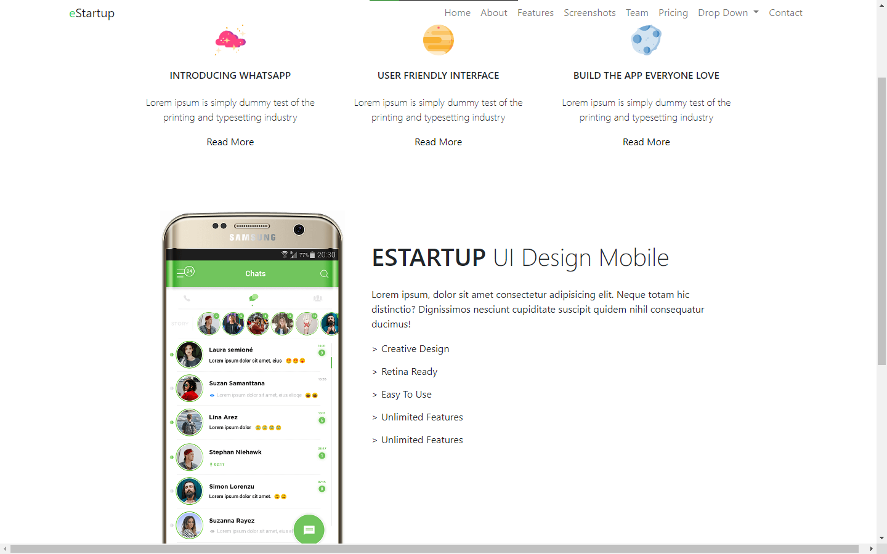
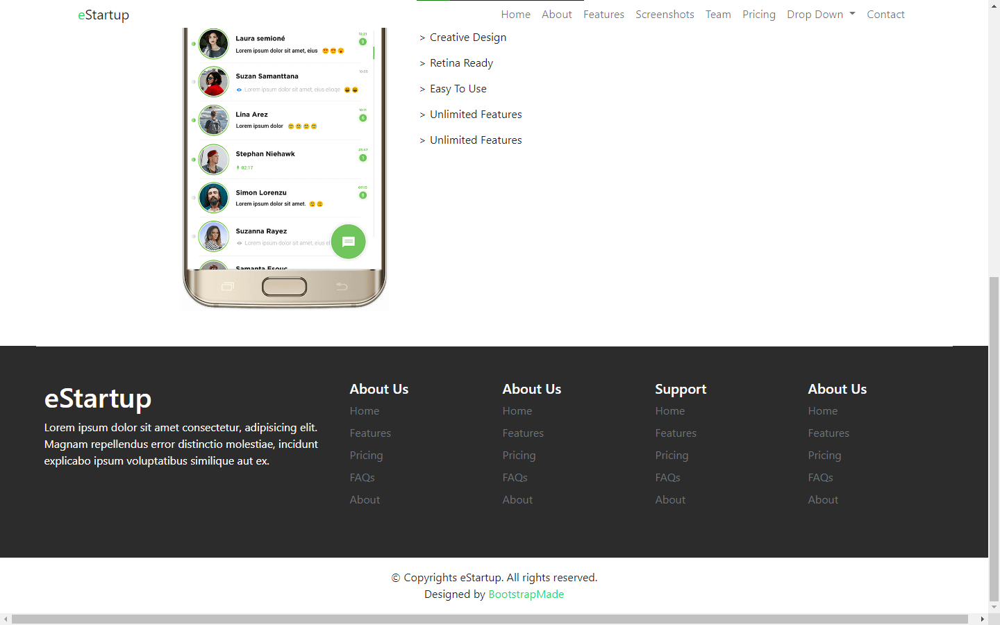

# 7 Bootstrap
## Resume
Dalam materi ini, saya mempelajari:
1. Penjelasan Bootstrap.
2. Alasan memilih Bootstrap.
3. Cara mendapatkan dan menggunakan Bootstrap.

### 1. Penjelasan Bootstrap.
Bootstrap adalah sebuah Front end framework terkenal yang digunakan untuk memudahkan user membuat tampilan pada web yang akan dibuat.

### 2. Alasan memilih bootstrap
Mengapa kita harus memilih bootstrap? Dapat dikatakan bootstrap merupakan front framework yang gratis, mudah digunakan dan dipelajari, cepat dan mendukung responsif.

### 3. Cara mendapatkan dan menggunakan Bootstrap.
Untuk menggunakan bootstrap kita bisa dengan mengunduh file css langsung pada website bootstrap, lalu di import ke file html dengan menggunakan tag link didalam header, untuk link sendiri dapat diakses [disni](https://getbootstrap.com/docs/5.1/getting-started/download/). Dan bisa juga kita mengimport file css langsung dengan menggunakan link tertentu saat di import ke dalam file html, dimana pada atribut href dari tag link, kita beri link langsung untuk mengakses file css dari internet.

### Task
Mengerjakan tugas yang diberikan Alterra pada link [disini](https://docs.google.com/document/d/1HlS8tK1b8HfobjdVQELTFv_GCKAkMOpjKXm9vYLSaw4/edit).  

output hasil dari kerjaan bagian header dan setengah body.  
  

Output bagian body.  
  

Output bagian footer.  
