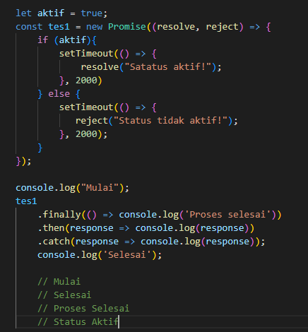

# 8 Javascript Refreshment
## Resume
Dalam materi ini, saya mempelajari:
1. Pendahuluan Javascript.
2. Values pada Javascript.
3. Varibel pada Javascript.
4. Destructuring pada Javascript.
5. Method pada Javascript.
6. Control flow pada Javascript.
7. Function pada Javascript.
8. Class pada Javascript.
9. Async-await pada Javascript.
10. DOM(Document Object Model).

### 1. Pendahuluan Javascript.
Javascript adalah bahasa pemrograman yang High-Level, Scripting, Untyped dan Interpreted. Dan mengapa javascript, karena javascript adalah bahasa pemrograman tingkat tinggi, yang dimaksud dengan pemrograman tingkat tinggi adalah tipe pemrograman dimana bahasanya semakin dimengerti oleh manusia, sehingga lebih mudah untuk dimengerti dan dipelajari, lalu javascript adalah bahasa script, dimana javascript itu dibuat untuk penetrasi dengan halaman web, apapun itu web browser nya, lalu javascript juga bahasa yang untyped yang artinya javascript tidak berpengaruh terhadap tipe data dan yang terakhir dari alasan kenapa javascript adalah karena javascript interpreted, dimana selama kita memiliki browser, javascript bisa dijalankan, bahasa yang flexible mudah untuk diuji, javascript juga memiliki beberapa library, contoh nya svelte, vue, react dan lain-lain.

### 2. Values pada javascript.
Values pada javascript terdapat var, let dan const, dimana hal yang berhubungan dengan tersebut materi nya adalah declaration, scoping dan hoisting.  
Maka apa itu declaration? Declaration adalah proses pembuatan variabel untuk menyimpan data, dimana pada javascript tiga cara dalam pendeklarasian, yaitu dengan Var, Let dan Const. Var merupakan tipe data yang akan jarang digunakan pada javascript, lalu let digunakan saat kita membutuhkan nilai yang dapat diubah dan const digunakan saat kita membutuhkan nilai yang tidak bisa di reassign, dimana pada tipe data const, kita harus memberi nilai pada variabel tersebut saat melakukan pendeklarasian. Ciri khas dari ketiga variable tersebut adalah var dapat di deklari ulang, berbeda dengan let dan juga const, yang tidak bisa di deklarasi ulang, untuk reassignment sendiri untuk let dan var dapat dilakukan, sedangkan untuk const tidak akan bisa, karena nilai nya const atau konsisten pada saat sudah di deklarasikan.  
Selanjutnya scoping, scoping adalah teknik dimana kita menentukan variabel, fungsi, dan objek diatur dan dapat diakses dalam kode kita. Ini berarti ruang lingkup variabel dikendalikan oleh lokasi deklarasi variabel. Dalam arti lain sebuah fungsi, objek dan varibel hanya dapat diakses dalam ruang lingkup tertentu berdasarkan lokasi variabel tersebut di deklarasikan.  
Hoisting adalah membuat beberapa jenis variabel atau fungsi yang dapat diakses / digunakan didalam kode sebelum dideklarasikan. Contoh dari hoisted adalah misal sebuah nilai b = 7 lalu baru kita deklarasiskan, tidak akan error, dan juga fungsi dipanggil sebelum fungsi dideklarasikan maka tidak akan error dan bisa berjalan, dan jika kita melakukan hoisting pada let dan const, maka tidak bisa.

### 3. Variable pada Javascript.
pada Javascript terdapat dua kategori tipe data, yaitu primitif dan objects. Primitive dalam pemrograman adalah unit pemprosesan terkecil dan elemen paling sederhana yang tersedia dalam bahasa pemrograman, contoh dari tipe data primitive adalah String, Boolean, Number, BigInt, Undefined, Null dan Symbol. Dan objects adalah unit yang menyimpan properti dan fungsi (method), contoh dari tipe data objects itu di antara lain object, array, function, date, set, map, weak set dan weak map. Aturan sederhana pada Javascript adalah bahwa semua nilai primitif diteruskan oleh nilai, misal kita memliki varible dengan tipe data primitif numeric, lalu kita teruskan nilai primitif pada variabel a ke varibel b, contohnya  
let a = 1;  
let b = a;  
Maka a = 1 dan b = 1 dan tipe data sama.

### 4. Destructuring pada Javascript.
Destructuring adalah ekspresi dari Javascript yang memungkinkan untuk menyalin nilai dari array, atau properti dari objek, ke dalam variabel yang berbeda. Contoh pada array adalah ada sebuauh fungsi dengan nama f() yang me return value array [1, 2, 3], lalu membuat deklarasi const [a, ,b] = f(), maka value a akan menjadi 1 dan value b akan menjadi 3 sesuai dengan value yang di return dari fungsi f().

### 5. Method pada Javascript.
Method adalah sebuah fungsi yang terkait dengan object, membuat programnya se-sederhana mungkin sesuai kegunaan masing-masing dapat dibilang bahwa method itu sebuah lifehack atau sebuah shortcut pada suatu code kita, misal kita menulis code sampai 25 baris, dengan menggunakan method kita bisa hanya perlu 1 baris saja. Pada method ada concat, map, foreach, slice, filter dan reduce pada Javascript.  
Concat digunakan untuk menggambungkan 2 nilai array dan mengembalikan salinan array yang digabungkan. Contoh dari concat:  
const array1 = ['a', 'b', 'c'];  
const array2 = ['d', 'e', 'f'];  
const array3 = array1.concat(array2);  
maka output dari print array3 adalah ["a", "b", "c", "d", "e", "f"].  

Map digunakan untuk membuat array baru dengan hasil memanggil fungsi setiap elemen array. Contoh dari map:  
const array1 = [1, 4, 9, 16];  
const map1 = array1.map(x => x * 2); //Dimana x adalah nilai dari tiap array1.  
Maka output dari map1 adalah [2, 8, 18, 32].  
Foreach, digunakan untuk memanggil fungsi setiap elemen array, contohnya:  
const array1 = ['a', 'b', 'c'];  
array1.forEach(element => console.log(element));  
maka outputnya.  
"a"  
"b"  
"c"  

Slice, digunakan untuk memilih bagian dari array, dan mengembalikan array baru.  
contoh const Hewan = ['Semut', 'Kambing', 'Unta', 'Bebek', 'Gajah'].  
console.log(Hewan.slice(2));  
Maka output akan menjadi ["Unta", "Bebek", "Gajah"].  

Filter, digunakan untuk membuat array baru dengan setiap elemen dalam array yang lulus seleksi. Contoh:  
const angka [1, 2, 3, 4, 5, 6];  
const result = angka.filter(nomor => nomor > 2);  
maka output: [3, 4, 5, 6].  

Reduce, digunakan untuk melakukan operasi pada setiap elemen array menjadi nilai tunggal (dari kiri ke kanan), contoh:  
const array1 = [1, 2, 3, 4];  
const reducer = (accumulator, currentValue) => accumulator + currentValue;  
Fungsi dapat digambarkan seperti 1+2+3+4.  
dimana hasil output dari reducer adalah 10.  

### 6. Control flow pada Javascript.
Ada dua tipe pada flow pada Javascript, yaitu control flow dan normal flow, normal flow adalah pengeksekusian statement dari atas ke bawah atau kiri ke kanan yang dilakukan secara berurutan. Dan control flow adalah mengatur alur eksekusi pada statement atau jalannya program sesuai keinginan kita. Untuk melakukan control flow, dibutuhkan pengulangan (loop/iterasi) dan pengondisian (percabangan) karena 2 hal ini kita dapat mengatur alur dari pengodingan kita. Untuk pengulagan Javascript memiliki For, While, Do While. Lalu pada percabangan terdapat if else, switch, block, try catch, break, continue, throw.  
Try Catch.  
Try bertugas mengeksekusi statement didalam nya, sedangkan catch betugas menangkap error yang terjadi pada statement di dalam try. Contohnya:  
  
Dimana jika error maka akan di print ke terminal apa errornya.

### 7. Function pada Javascript.
Funtion di dalam Javascript adalah sebuah objek. Karena memiliki properti dan juga method. Function digunakan untuk melakukan serangkaian komputasi/prosedur yang dapat digunakan berulang kali. Contoh dari fungsi dapat dilihat pada screenshot berikut.  
  
Maka output nya adalah Abullah Nouval.  

Lalu ada juga function expression, dimana kita membuat sebuah function sebuah variabel. Contohnya:  
  
Output akan sama dengan fungsi yang tadi sudah di tunjukan.  

Lalu ada arrow function hampir sama dengan function expression namun penulisan function di tiadakan, sehingga penulisan kode jadi lebih simpel, contoh:  
  

### 8. Class pada Javascript.
Class adalah protoype dari suatu object yang akan kita buat. Lalu constructor adalah method di dalam class yang akan selalu terpanggil pertama kali ketika membuat objek. Lalu method adalah sebuah fungsi yang berada di dalam class. Lalu attributes adalah kumpulan variabel yang membentuk object yang dimiliki oleh suatu class.
Contoh dari class pada javascript dapat dilihat pada foto berikut.  
  
dimana pada class diatas ada nama class Orang, dengan constructor yang berisikan nama dan umur lalu ada method atau funsgi dalam kelas bernama perkenalkan yang me return value yang tertulis, lalu ada pendeklarasian variabel dari kelas dengan nama dan umur yang sudah diisi, dan jika method dipanggil maka output akan menjadi saya Abdullah, umur 23 tahun.  
Lalu pada class terdapat extends digunakan untuk membuat kelas anak dari kelas induk. Kelas anak mewarisi semua atribut dan metode dari kelas induk. Contohnya:  
  

### 9. Async-await pada Javascript.
Pada async-await di javascript terdapat Sysnchronous, Asysnchronous, Callback, Promise, Asysnchronous function dan await.  
Sysnchronous adalah mengeksekusi setiap perintah satu persatu sesuai urutan kode yang dituliskan. Contohnya:  
  

Lalu Asysnchronous hasil eksekusi atau output tidak selalu berdasarkan urutan kode, tetapi berdasarkan waktu proses.
Contohnya:  
  

Lalu ada callback, callback adalah fungsi yang dikirimkan sebagai parameter pada fungsi lain atau callback adalah funsgi yang dieksekusi setelah fungsi lain selesai dijalankan. Contohnya:  
  

Lalu promise, promise adalah objek yang merepresentasikan keberhasilan atau kegagalan pada sebuah event yang asysnchronous dimasa mendatang. Contohnya:  
  

Fungsi asysnchronous merupakan sebuah function yang bekerja secara asysnchronous yang menghasilkan promise sebagai return value-nya, tetapi cara penulisan code-nya menggunakan penulisan yang sysnchronous (standar). Contohnya:  
  

### 10. DOM(Document Object Model).
Dom adalah API untuk HTML yang merepresentasikan halaman web pada suatu dokumen menjadi sebuah objek. Pada DOM terdapat 3 hal yaitu selection method, manipulation dan event. Contoh dari event adalah getElementById() yang digunakan untuk mengambil element pada html berdasarkan id. Contoh juga ada getElementsByTagName(), mengambil elemen yang berhubungan dengan tag tertentu secara menyeluruh, di return value dalam bentuk array.  
Lalu ada DOM manipulation, ada element.innerHTML, yang digunakan untuk merubah isi dari tag yang sudah kita seleksi, lalu ada element.style.(PropertiCSS) digunakan merubah style dari tag yang sudah kita seleksi, lalu element.setAttribute(), digunakan untuk mengelola/memanipulasi attribute yang sudah kita seleksi dan ada element.classList.add(), digunakan untuk mengelola/memanipulasi class yang sudah kita seleksi.  
Lalu ada event seperti onclick, onchange, onblur, onmousehover, onmouseout, oncopy.

## Task
  
  
  
  

### Jawaban no 1
a. Output:  
  
b. Output:  
  
c. Output:  
  
d. Output:  

### Jawaban no 2
a. Karena pada saat melakukan pendeklarasian dari nilai terdaftar diisikan false, maka saat di run karena false atau tidak benar, maka pada percabangan tidak akan diseksekusi isinya.  
b. Karena ada teori scoping pada Javascript, dimana sebuah variabel hanya dapat diakses pada ruang lingkup tertentu, dan yang didalam fungsi deklarasinya, maka tidak akan digukanan di luar fungsi, dan jika digunakan maka akan meyababkan error.
c. Tidak bisa karena tidak merubah bahwa variabel asal terdapat didalam fungsi perkenalkan().

### Jawaban no 3
Jawaban dan juga output dapat dilihat di foto berikut.  

### Jawaban no 4
Output dengan mengubah tanda - menjadi / di array.  
  

### Jawaban no 5
Output dan juga kodingan untuk jawaban no 5.  
  

### Jawaban no 6
Output dan juga kodingan untuk jawaban no 6.  
