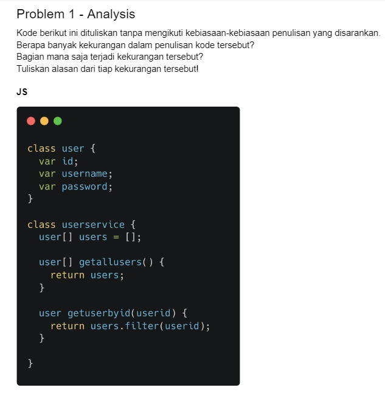
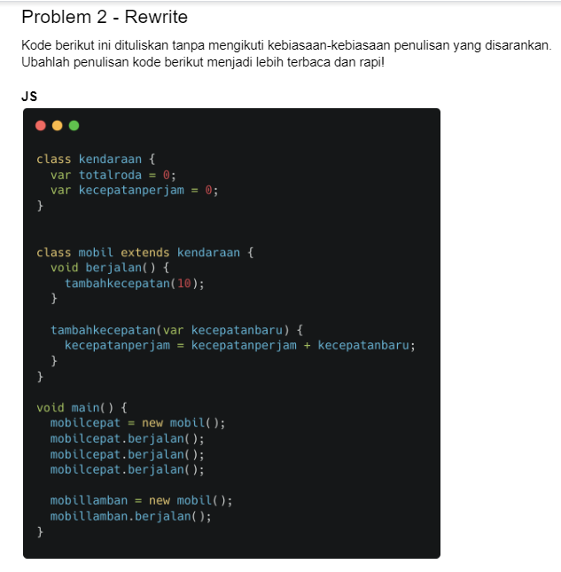
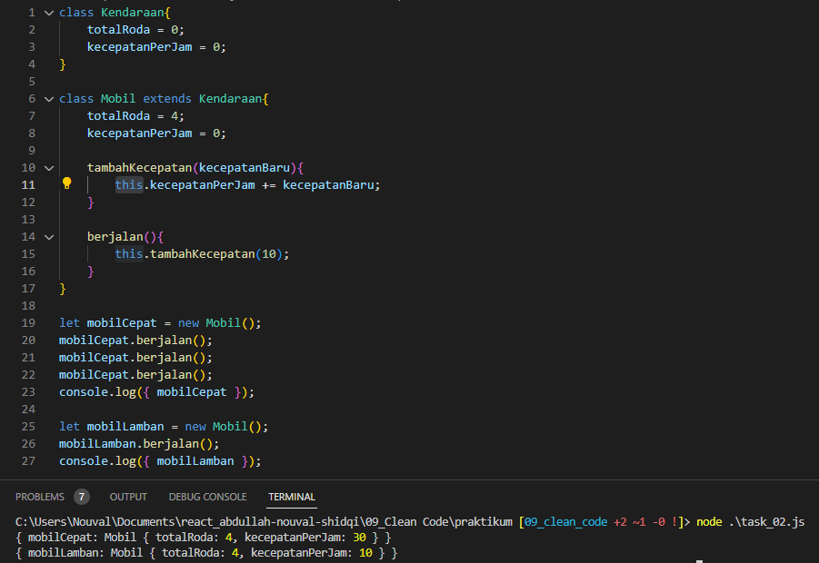

# 9 Clean Code
## Resume
Pada materi ini, saya mempelajari:
1. Apa itu clean code?
2. Kenapa clean code?
3. Karakteristik clean code.
4. Clean code principle.

### 1. Apa itu clean code?
Clean code adalah istilah untuk kode yang mudah dibaca, difahami dan diubah oleh programmer. Sebagaimana kata seorang Brandon Gregory seorang computer science, mengatakan working code isn't necessary good code. Your code also need to be easy to read, understand, and modify. yang artinya Mengerjakan sebuah kode saja tidak dapat dikatakan kode yang baik. Kode me perlu untuk mudah dibaca, di mengerti dan di meodifikasi. Ada juga kata lain dari salah satu programmer yang mengatakan Any fool write code that computer can understand. Good programmers write code that humans can understand, yang artinya Semua orang bodoh menulis kode yang dapat di mengerti oleh komputer. Programmer yang baik menulis kode yang dapat di mengerti oleh manusia.

### 2. Kenapa clean code?
Karena semua orang harus bisa baca apa yang kita kerjakan dalam dunia pekerjaan programmer, sehingga tim para pekerja dapat mudah memahami, dan mudah di modifikasi.

### 3. Karakteristik clean code.
Karakteristik dari clean code sendiri di antara lain:
1. Penamaan yang mudah difahami, sebagai contoh penamaan sebuah variabel tidak dengan menggunakan satu huruf saja misalnya let b = 0; dan lainnya.
2. Mudah dieja dan dicari, misal kita menggunakan angka 86400000 untuk sebuah set timeout, jadi kita tidak tahu apa itu 86400000 dan jika kita bikin nama variable dari hal tersebut sebagai MILISECOND_IN_A_DAY sehingga kita tahu bahwa itu jumlah mili second dalam satu hari.
3. Singkat namun medeskripsikan konteks, misal jika kita membuat sebuah kode, kita berusaha untuk menamakan parameter dengan jelas tentang apa dan untuk apa ini, sehingga membantu kita untuk lebih mengerti dan cepat dicerna oleh kita.
4. Konsisten, sebagaimana katanya, kita harus konsisten dalam kodingan kita, misal kita menggunakan camel case untuk variabel, menggunakan pascal case untuk class dan lainnya.
5. Tidak adanya penambahan konteks yang tidak perlu.
6. Komentar, dimana komentar dapat digunakan pada kode untuk kita menjelaskan untuk apa ini, untuk apa sih line ini dan lainnya, tapi tidak digunakan terlalu banyak, tapi cukup point utama sehingga yang membaca kode dapat lebih terpandu untuk membaca kode yang sudah di kerjakan.
7. Function, misal dimana function paramter digunakan dengan tulisan yang kurang jelas atau terlalu abstrak, sehingga kurang dimegerti, maka dari itu kita harus beri cukup rincian untuk menunjukan bahwa parameter ini berisi ini dan itu.
8. Formatting, misal lebar baris code itu 80 - 120 karakter, satu class 300 - 500 baris, baris code yang berhubungan saling berdekatan, dekatkan fungsi dengan pemanggilnya, deklarasi variabel berdekatan dengan penggunanya, perhatikan indentasi dan menggunakan prettier dan formatter.

### 4. Clean code principle.
Salah satu dari principle clean code adalah KISS(Keep It So Simple), dimana kita harus menghidari suatu fungsi yang melakukan lebih dari satu hal, lalu ada DRY(Don't Repeat Yourself), dimana kode digunakan berulangan yang biasa terjadi akibat melakukan copy-paste terlalu sering atau banyak, dimana jika ada kesalahan kita bisa melakukan refaktor, atau perbaiki kode yang sudah dibuat.

## Task
Tugas yang diberikan alterra dapat dilihat pada foto berikut.  
  
  

### Jawaban no 1
Dapat dilihat pada kumpulan komen di kodingan [task1_01.js](./praktikum/task_01.js) untuk penjelasan pada bagian salah nya dimana.

### Jawaban no 2
Dapat dilihat bentuk yang sudah dibenarkan disini [task_02.js](./praktikum/task_02.js) dimana disini saya menggantikan beberapa cara penulisan, dimana class sekarang menggunakan pascalcase yang tadinya tidak, sebagaimana variabel diganti dengan camelcase, dan membenarkan beberapa bagian yang membuat kodingan error saat di run, seperti dibagian method menggunakan void, dan pada bagian method ada yang tidak menggunakan this membuat codingan error.  
Berikut adalah output saat kodingan dijalankan dengan kodingannya.  
