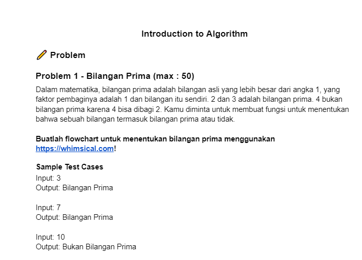
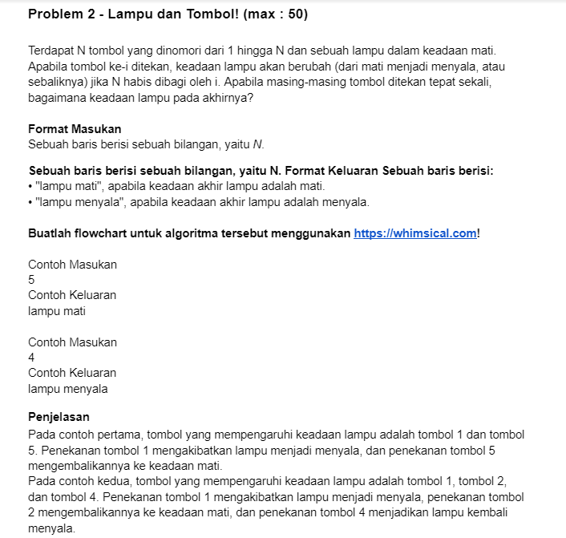
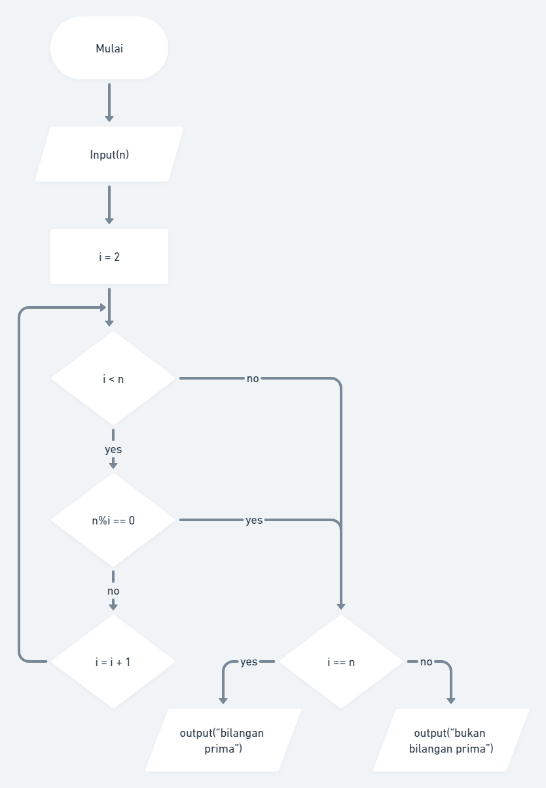
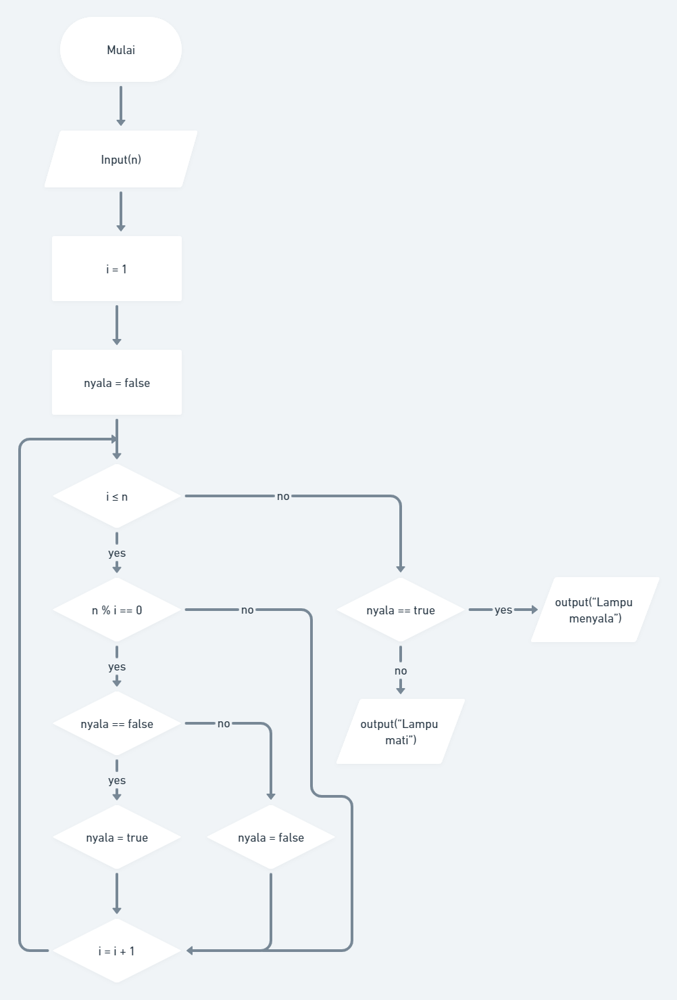

# 10 Introduction Algorithm
## Resume
Pada materi ini, saya mempelajari:
1. Apa itu algoritma?
2. Contoh dari algoritma.
3. Karakteristik algoritma.
4. Algoritma Dasar.
5. Pseudo code.

### 1. Apa itu algoritma?
Algoritma adalah prosedur komputasi yang didefinisikan dengan baik yang mengambil beberapa nilai sebagai input dan menghasilkan beberapa nilai sebagai output. Dari input, process dan output.

### 2. Contoh dari algoritma.
Contoh dari algoritma di antara lain:
1. Check number prime.  
Dimana ini adalah sebuah algoritma untuk mengecek apakah nomor input adalah prima atau bukan, lalu program bisa memberikan output apakah input tersebut bilangan prima atau tidak.
2. Sorting.  
Algoritma yang digunakan untuk melakukan pengurutan berdasarkan kumpulan data input angka tau string.
3. Searching.  
Mencari data dari input yang sudah diberikan dan program memberikan output dari data yang sudah dicari.

### 3. Karakteristik algoritma.
Karakteristik dari algoritma di antara lain:
1. Memiliki batas (terdapat awalan dan akhiran).
2. Instruksi terdefinisikan dengan baik.
3. Efektif dan efisien.

### 4. Algoritma Dasar.
Dalam penyusunan algoritma terdapat tiga konsep utama yang harus kita ketahui, yaitu sequential, branching, dan looping.
1. Sequential.
Maksud dari sequential sendiri itu adalah urutan dalam menyusun langkah-langkah untuk menyelesaikan masalah, misal kita ingin menyelesaikan masalah kita harus melewati tahap a, b dan c secara berurut, sehingga kita harus menyusunnya dengan tepat.
2. Branching.
Konsep yang digunakan untuk menunjukan sebuah alur atau flow dari program, misal jika terdapat suatu kondisi tertentu maka proses selanjutnya akan dieksekusi itu nanti seperti apa, misal apakah yang dieksekusi itu a atau b.
3. Looping.
Looping adalah konsep untuk melakukan sebuah aksi secara berulang, sampai dengan kondisi tertentu terpenuhi, maka looping akan berhenti.

### 5. Pseudo code.
Misal berdasarkan kasus untuk menghitung luas segitiga, maka tahapan yang dilakukan adalah INPUT alas dan tinggi, CALCULATE luas = (alas x tinggi)/2, dan PRINT luas, dan hal ini dapat digambarkan dengan beberapa cara, salah satunya adalah flowchart, dimana flowchart adalah suatu bagan dengan simbol tertentu yang menggambarkan urutan dan hubungan antar proses secara mendetail.

## Task
Mengerjakan tugas berikut yang diberikan alterra.  
  
  

### Jawaban no 1
Berikut adalah gambar dari flowchart yang telah saya buat, dapat dilihat juga melalui link [disni](https://whimsical.com/flowchart-4M1DvFvVPUcmaYTW9pgKjq@2Ux7TurymMw1DAz5ENLv)  
  

### Jawaban no 2
Berikut adalah gambar dari flowchart yang telah saya buat, dapat dilihat juga melalui link [disni](https://whimsical.com/flowchart2-Qz9utTpGbiSWMzHTUXeCjJ@2Ux7TurymN2stWKAR7oV)  
