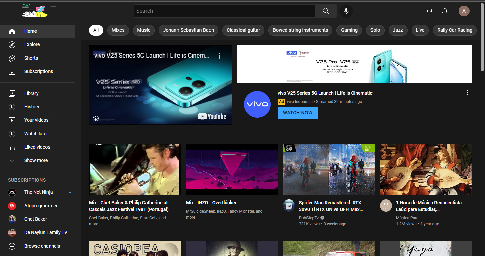

# 11 Introduction React
## Resume
Pada materi ini, saya mempelajari:
1. Apa itu react?
2. Alasan kenapa kita membutuhkan javascript library untuk membuat user interface dan apa user interface itu.
3. Kenapa menggunakan React?

### 1. Apa itu react?
React adalah sebuah library JavaScript untuk membuat sebuah user interace atau UI. Jadi react itu library bukanlah framework, dimana react digunakan sebagai yang mengatur.

### 2. Alasan kenapa kita membutuhkan javascript library untuk membuat user interface dan apa user interface itu.
User interface adalah tempat kita bisa menggunakan dan berkomunikasi dengan aplikasi yang kita buat, pada kasus aplikasi berbasis web, user interface nya adalah website yang biasanya kita akses dengan menggunkan web browser. Contoh dari user interface bisa dilihat pada foto berikut. Yaitu sebuah tampilan menu utama pada youtube.  
  
Dapat dilihat bahwa youtube ini memiliki tampilan ui yang sangat interaktif, dan interaktif inilah yang dapat dibuat dengan menggunakan JavaScript, yaitu adalah salah satu fungsi utama kita mengimplementasikan JavaScript pada website kita.

### 3. Kenapa menggunakan React?
Untuk alasan utama yang berada pada link utama react adalah react itu declarative, component base dan learn once, write anywhere. Maka dari itu apaah yang dimaksud dengan deklaratif dan alasan lainnya?
1. Deklaratif.  
Deklaratif adalah satu pendakatan saat kita ngoding yang berfokus kepada what nya, atau dalam kata lain, apa yang sebenarnya ingin kita capai, untuk lawan dari deklaratif sendiri adalah imperatif yang berfokus pada how atau bagaimana kita mencapai tujuan itu.

2. Component Base atau berbasis komponen.  
Ketika kita membuat sebuah aplikasi mungkin saja aplikasi sudah kompleks, sebenarnya aplikasi-aplikasi itu bisa kita breakdown menjadi beberapa bagian-bagian yang lebih kecil atau dalam hal ini kita sebut komponen dan tiap-tiap komponen ini memiliki tugas masing-masing, dan menganut single responsive principle, jadinya nanti aplikasi kita pada react bisa scale dengan baik karena tiap-tiap komponen itu sudah punya tugasnya masing-masing jadi tidak campur aduk.

3. Learn Once, Write Everywhere atau belajar sekali, tulis dimana saja.  
Ketika kita sudah faham dengan react dan kita bisa membuat aplikasi web menggunakan react, maka kita juga bisa menulis aplikas ios, dan android dengan menggunakan react native, yang konsepnya itu sangat mirip dengan react pada browser, sehingga kita tidak perlu banyak belajar mungkin perlu penyesuaian sedikit jadi kita sudah bisa membuat aplikasi native.

4. Sudah teruji  
React ini sudah banyak digunakan di aplikasi-aplikasi pada perusahaan besar, seperti facebook, netflix, american express, instragram, traveloka dan airbnb.

5. React merupakan teknologi yang populer  
Dibanding library lain, react merupakan sebuah library yang paling sering di download daripada library lainnya berdasarkan data tertentu.