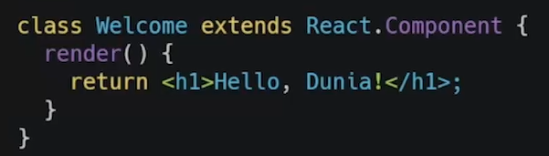

# 12 React Fundamental
## Resume
Pada materi ini, saya mempelajari:
1. Apa itu JSX?
2. Kenapa menggunakan JSX?
3. JSX vs React.createElement
4. Spesifikasi jenis elemen React
5. Menaruh expression pada JSX
6. JSX adalah expression
7. Menentukan atribut dengan JSX
8. Memspesifikasikan elemen anak dengan JSX
9. Apa itu React component?
10. Bagaiman membagi UI menjadi beberapa komponen
11. Function dan class component
12. Membuat dan merender komponen
13. Apa itu props?
14. React Lifecycle
15. Lifecycle Mathods
16. Render bersyarat
17. Struktur Direktori pada projek react
18. Styling pada react dengan class dan css
19. Styling pada react pada atribut style
20. Styling pada react dengan modul css

### 1. Apa itu JSX?
Jsx adalah singkatan dari JavaScript XML dan merepukan ekstensi sintaks pada JavaScript yang kegunaannya sangat di sarankan di React karena lebih menggambarkan apa yang seharusnya tampak pada user interface, JSX sendiri nantinya akan menghasilkan React Element.

### 2. Kenapa menggunakan JSX?
Karena JSX dibuatkan berdasarkan fakta kalau logika rendering sangat terikat dengan logic UI, seperti bagaimana event ditangani, sebagaimana state berunah dan bagaimana pula data di siapkan untuk ditampilkan, satu lagi alasannya adalah jsx memiliki seperation of technology dengan memisahkan markup dengan logika, dengan menggunakan react kita bisa menggambungkan teknologi itu dan memisahkannya sesuai dengan kepentingannya, atau yang biasa kita sebut dengan Seperation of Concern.

### 3. JSX vs React.createElement
Sebenarnya kita tidak perlu menggunakan JSX, tapi JSX memudahkan kita menulis aplikasi React, pada dasarnya, JSX adalah menyediakan sintaksis yang mudah untuk ditulis dan dimengerti atau yang biasa kita sebut juga dengan sugar untuk react.getElement.

### 4. Spesifikasi jenis elemen React
Sebenarnya secara mudahnya, jenis elemen react itu dibagi menjadi dua, yaitu kapitalisasi untuk komponen React dan huruf kecil untuk komponen bawaan.

### 5. Menaruh expression pada JSX
Kita dapat menaruh ekspresi JavaScript yang valid pada JSX dengan menggunakan kurung kurawal, contoh {nama}.

### 6. JSX adalah expression.
Jadi setelah di kompilasi, ekspresi JSX akan menjadi panggilan fungsi JavaScript biasa dan menjadi objek JavaScript.

### 7. Menentukan atribut dengan JSX
Tanda kutip untuk menentukan elemen string literal, lalu kurung kurawal untuk menyematkan ekspresi JavaScript, lalu untuk ReactDOM menggunakan camelCase sebagau konversi penamaan.

### 8. Memspesifikasikan elemen anak dengan JSX
Jika tag bersifat kosong, kita bisa saja menutupnya secara langsung dengan />, lalu tag JSX dimungkinkan untuk memiliki elemen anak.

### 9. Apa itu React component?
Komponen react adalah bagian kode yang dapat digunakan kembali yang digunakan untuk menentukan tampilan, behavior, dan state sebagian UI.

### 10. Bagaiman membagi UI menjadi beberapa komponen
  
Dapat dilihat pada foto diatas kita bisa membagikan kebeberapa komponen sehingga kode lebih mudah diatur dan lebih mengerti.

### 11. Function dan class component
Untuk membuat komponen yaitu terdapat 2 cara, yaitu dengan menggunakan fungsi, atau dengan menggunakan class. Contohnya dapat dilihat pada foto dengan berurutan, yaitu menggunakan function lalu class.  

  

### 12. Membuat dan merender komponen
Dapat dilihat contoh nya pada foto berikut, dimana function mereturn sebuah jsx lalu dimasuki ke dalam reactDOM.render() untuk di render component welcome yang telah di deklarasi kan dengan nama element.  

### 13. Apa itu props?
1. Singkatan dari properties, membuat kita dapat memberikan argumen/data pada component.
2. Props membantu untuk membuat komponen menjadi lebih dinamis.
3. Props dioper ke component sama seperti memberikan atribut pada tag HTML.
4. Props pada component adalah read-only dan tidak dapat diubah.

### 14. React Lifecycle
Untuk gambaran react lifecycle seperti apa, dapat dilihat pada foto berikut.  

### 15. Lifecycle Mathods
1. Render().  
Ini adalah lifecycle method yang paling sering kita temui, pada komponen menggunakan class fungsi render ini menjadi mandatory jadi jika kita mebuat component class tanpa method render maka component kita akan error, pada render ini pula kita harus menggunakan function, jadi disini tidak boleh ada side effect juga seperti perubahan state.

2. ComponentDidMount().  
Ini adalah method yang dipanggil pertama kali ketika komponen sudah di mount dan sudah siap, dan ini adalah tempat yang sangat tepat untuk pemanggilan API, dan boleh ada setState().  

3. componentDidUpdate().  
Method ini dipanggil ketika komponen mengalami update seperti props atau state berubah.

5. componentWillUnmount().  
Ini adalah method yang dipanggil ketika komponen akan dihancurkan dan cocok untuk clean up actions.

### 16. Render bersyarat
Pada react, kita dapat membuat komponen berbeda yang mencakup perilaku yang dibutuhkan. Lalu, kita dapat me-render hanya beberapa bagian saja, berdasarkan state dari aplikasi yang telah kita buat. Dapat menggunakan if, inline if dengan operator &&, inline if-else dengan tenary conditional operator yang digunakan untuk mencegah komponen untuk rendering.

### 17. Struktur Direktori pada projek react
React tidak memiliki pendapat tentang bagaimana cara memasukkan file ke folder, namun ada beberapa pendekatan pada ekosistem react yang cukup populer mungkin bisa kita pertimbangkan.
1. Pengelompokkan berdasarkan fitur atau rute.  

2. Pengelompokkan berdasarkan jenis file.  

3. File structure yang biasa digunakan oleh mentor untuk projek besar.  
  

Tips-tips dalam struktur direktori di antara lain:
1. Hindari telalu banyak nesting.
2. Jangan terlalu memikirkannya.

### 18. Styling pada react dengan class dan css
Dapat dilihat pada foto berikut contoh dari styling pada react dengan class dan css, dan ini merupakan cara yang paling simpel.  

### 19. Styling pada react pada atribut style
Contohnya dapat dilihat pada foto berikut.  
  

### 20. Styling pada react dengan modul css
Dapat dilhat pada foto berikut contohnya.  
