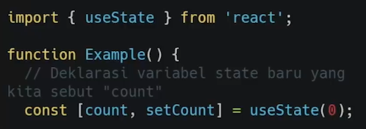
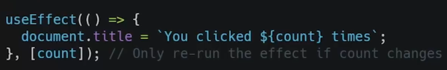

# 14 React Hook
## Resume
Dalam materi ini, saya mempelajari:
1. Apa itu React Hooks?
2. Ide atau motivasi dari React Hooks
3. Hooks-hooks pada React
4. Aturan-aturan pada Hooks yang harus kita ikuti
5. Implementasi useState dan useEffect

### 1. Apa itu React Hooks?
Hooks merupakan fitur baru di React 16.8. Dengan hooks, kita dapat menggunakan state dan fitur React yang lain tanpa perlu menulis sebuah kelas.

### 2. Ide atau motivasi dari React Hooks
Motivasi atau munculnya React Hooks ini, di antara lain:
1. Kesulitan untuk menggunakan kembali state logic antar komponen.
2. Komponen kompleks menjadi sulit untuk di mengerti.
3. Kelas membingungkan manusia dan mesin.

### 3. Hooks-hooks pada React
Pada hooks dasar, terdapat 3 hooks, yaitu:
1. useState
2. useEffect
3. useContext  

Dan juga terdapat Hooks tambahan, seperti useReducer, useCallback, useRef, useImperativeHandle, useLayoutEffect, dan useDebugValue.

### 4. Aturan-aturan pada Hooks yang harus kita ikuti
1. Hanya panggil hooks dari dalam loops, conditions, atau nested functions.
2. Hanya panggil hooks dari fungsi-fungsi React. Jadi jangan panggil Hooks dari fungsi-fungsi Javascript biasa.

### 5. Implementasi useState dan useEffect
Contoh penggunaan useState pada sebuah function dapat dilihat pada foto berikut.  
  

Dan juga contoh penggunaan useEffect dapat dilihat pada foto berikut.  
