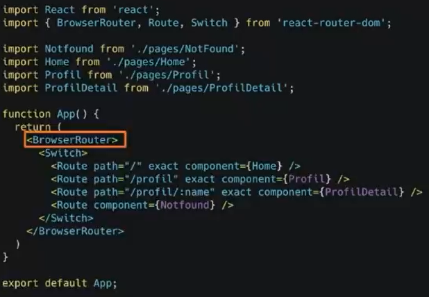
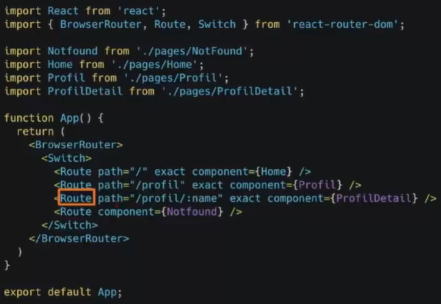
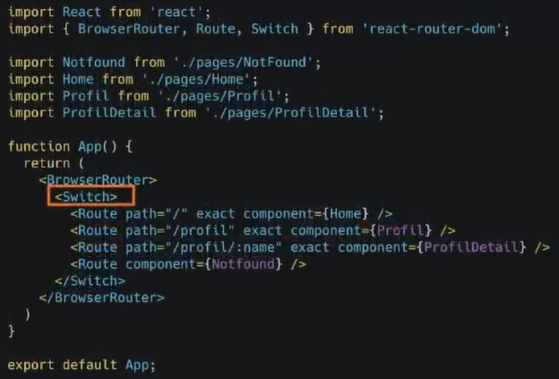
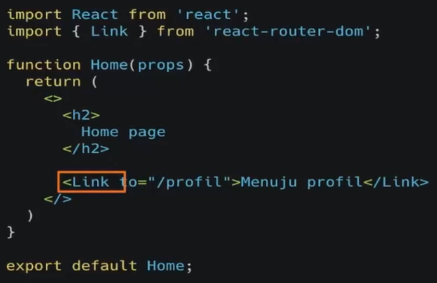
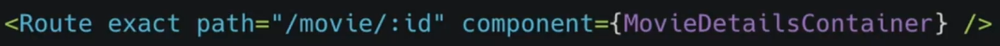

# 15 React Routing
## Resume
Dalam materi ini, saya mepelajari:
1. Apa itu router?
2. MPA(Multi Page Application) atau kebalikan dari SPA
3. SPA(Single Page Application)
4. Keunggulan SPA dan PMA
5. Kekurangan SPA dan PMA
6. React Router
7. Browser Router
8. Route
9. Switch
10. Link
11. URL Parameter pada React
12. Hooks-hooks yang dimiliki oleh ReactRouter

### 1. Apa itu route?
Router merupakan modul dalam react yang berfungsi untuk melakukan proses navigasi pada SPA(Single Page Application)

### 2. MPA(Multi Page Application) atau kebalikan dari SPA
Multi Page Application juga disebut dengan tradisional web app adalah jenis aplikasi website dimana perlu memuat ulang seluruh halaman web setiap kali membuat permintaan baru.

### 3. SPA(Single Page Application)
Single Page Application adalah salah satu jenis aplikasi website dimana hanya ada 1 halaman yang menangani semua aktivitas yang terjadi pada aplikasi tersebut.

### 4. Keunggulan SPA dan PMA
Keunggulan dari SPA sendiri di antara lain:
1. Waktu loading website jauh lebih cepat.
2. Tidak ada query tambahan ke server.
3. Front-end yang cepat dan responsif.
4. Meningkatkan pengalaman pengguna(User Expirience).  

Dan untuk keunggulan dari MPA, di antara lain:
1. SEO website akan lebih mudah dioptimisasi.
2. Memudahkan untuk mengubah halaman tertentu untuk setiap kebutuhan yang berbeda.
3. Menggunakan tools analisis seperti Google Analytics yang dapat terintegrasi langsung dengan website.

### 5. Kekurangan SPA dan PMA
Untuk kekurangan dari SPA sendiri di antara lain:
1. Tidak bagus dalam hal SEO.
2. Berat saat di load/buka pertama kali.
3. Kurang aman dibanding dengan Website biasa.
4. Masalah kompatibilitas browser.  

Dan untuk kekurangan dari PMA di antara lain:
1. Kecepatan download webiste yang jauh lebih lama jika dibandingkan dengan SPA.
2. Kamu perlu mengintegrasikan antara front-end dan back-end.
3. Lebih sering membutuhkan maintenance dan update.
4. Mungkin akan lebih sering menemukan masalah peforma pada webiste.

### 6. React Router
Untuk membuat sebuah router atau single page application pada react, kita menggunakan package yang dinamakan react router, untuk instalasi cukup dengan memberikan command seperti **"npm install react-router-dom --install"** dan juga ada beberapa komponen-komponen penting yang akan sering kita gunakan di library react-router-dom, di antara lain ada BrowserRouter, Switch, Route, dan Link.

### 7. Browser Router
BrowserRouter adalah komponen yang digunakan sebagai router yang menggunakan API history dari HTML5, sehingga dapat menggunakan location untuk sinkronan UI dengan url. Di dalam object location sendiri merepresentasikan dimana lokasi aplikasi sekarang. Contoh penggunaan dapat dilihat pada foto berikut.  

### 8. Route
Route merupakan komponen yang digunakan sebagai pengarah jalan lalu lintas suatu aplikasi web. Dapat dilihat pada foto berikut.  
  
Dapat dilihat disini terdapat attribute path, path disini merupakan URL pada browser pada proses routing, dan juga ada attribute component yang merupakan suatu komponen yang akan ditampilkan kepada user saat mengakses path yang didefinisikan.

### 9. Switch
Switch disini merupakan komponen yang digunakan untuk membungkus kumpulan beberapa komponen Route. Dapat dilihat pada foto berikut.  
  

### 10. Link
Link adalah komponen yang digunakan untuk berpindah antar halaman, property to tersebut merujuk pada path di route yang akan dituju, untuk penggunaan sendiri dapat dilihat pada foto berikut.  

### 11. URL Parameter pada React
Parameter URL adalah suatu parameter yang nilainya ditetapkan secara dinamis di URL halaman. Contoh dapat dilihat pada foto berikut.  
  
Dimana kita bisa lihat nilai id disitu merupakan sebuah parameter yang nanti akan di akses berdasarkan id yang dimasukkan ke parameter.

### 12. Hooks-hooks yang dimiliki oleh ReactRouter
1. useHistory.  
useHistory merupakan hooks yang memberi kita akses ke instance riwayat yang dapat anda gunakan untuk bernavigasi. Contohnya history.length, history.goBack dst.

2. useLocation
useLocation mengembalikan objek lokasi yang mewakili URL saat ini. Anda dapat memikirkannya seperti useState yang mengembalikan lokasi baru, setiap kali URL berubah.

3. useParams
useParams mengmbalikan objek pasangan kunci/nilai parameter URL. Gunakan untuk mengakses match.params dari Route saat ini.

4. useRouteMatch
useRouteMatch mencoba mencocokkan URL saat ini dengan cara yang sama seperti Route. Ini sebagian besar berguna untuk mendapatkan akses data kecocokan tanpa benar-benar merender Route.