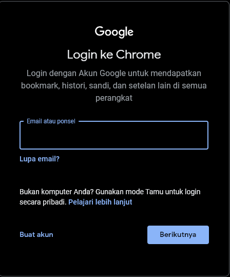
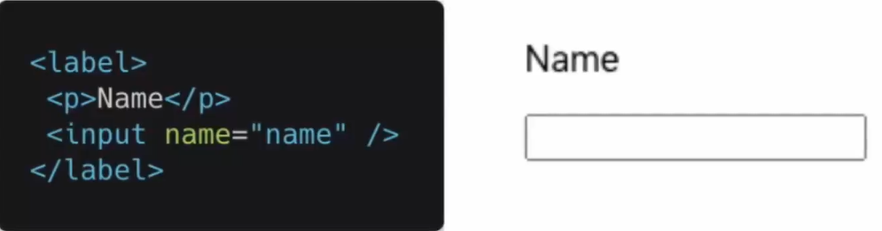
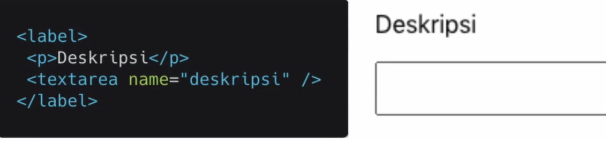
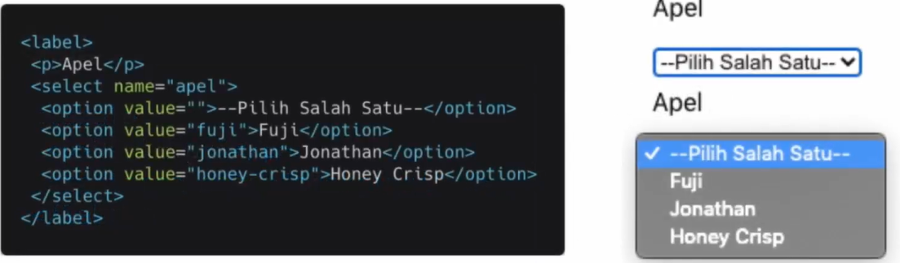
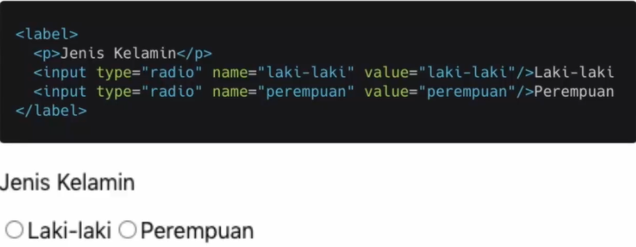
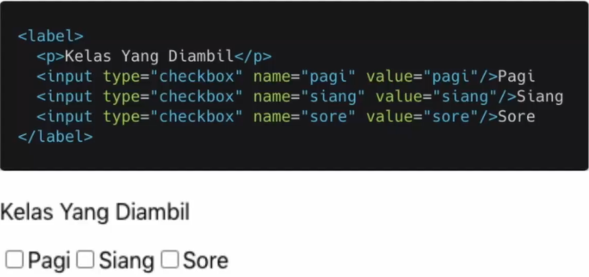

# 16 React Form
## Resume
Dalam materi ini, saya memepelajari:
1. Penerapan Form
2. Macam-macam form yang berada di React
3. Apa itu controlled component?
4. Apa itu uncontrolled component?
5. Kenapa perlu validasi pada form?
6. Tipe Validasi Data Formulir 

### 1. Penerapan Form
Form merupakan salah satu hal krusial dalam pengembangan aplikasi website. Form dapat digunakan untuk menghandle inputan dari user. Form banyak kita jumpai saat login mendaftarkan sesuatu, memberikan feedback, mengisi data dan masih banyak lainnya. Dapat dilihat form sign in dari google pada foto berikut.  

### 2. Macam-macam form
Yang pertama ada elemen input, dimana element input biasanya digunakan inputan yang tidak terlalu panjang. Conoth dapat dilihat pada foto berikut.  
  

Lalu ada lagi element textarea, dimana textarea ini biasanya digunakan untuk inputan yang cukup panjang. Semisal deskripsi.  
  

Lalu ada elemen select, elemen select biasanya digunakan untuk inputan yang pilihannya sudah ditentukan. Contoh nya dapat dilihat pada foto berikut.  
  

Lalu ada radio button, dimana radio button ini merupakan salah satu type di elemen input. Kita hanya bisa memilih 1 pilihan menggunakan radio button. Contoh dapat dilihat pada foto berikut.  
  

Lalu ada checkbox, checkbox ini merupakan salah satu type elemen di input. Kita bisa memilih 1 pilihan bahkan lebih menggunakan checkbox. Contoh dapat dilihat pada foto berikut.  
  

Dan banyak lagi type input yang lainnya.

### 3. Apa itu controlled component?
Kita dapat menggambungkan cara menyimpan dan memperbarui state di HTML dan React dengan menggunakan state pada React. Kemudian komponen react yang me-render sebuah form juga mengontrol apa yang terjadi dalam form tersebut pada masukkan pengguna selanjutnya. Jadi dapat disimpulkan bahwa, controlled component merupakan sebuah elemen masukkan form yang nilainya dikontrol oleh React melalui cara seperti ini disebut sebagai "Controlled Component".

### 4. Apa itu uncontrolled component?
Uncontrolled Component adalah alternatif lain dari controlled component, dimana data form akan ditangani oleh DOM-nya sendiri. Untuk menulis uncontrolled component, alih-alih menulis event handler untuk setiap pembaruan state, kita bisa menggunakan ref untuk mendapatkan nilai nilai form dari DOM. Karena hal ini terkadang lebih mudah untuk mengintegrasikan kode React dan non-React jika menggunakan uncontrolled component. Ini berarti lebih sedikit kdoe jika kita menginginkan solusi cepat walau tak rapi. Selain itu pada umumnya kita harus menggunakan controlled component.

### 5. Kenapa perlu validasi pada form?
Pada dasarnya, ada 3 alasan mengapa validasi form diperlukan, di antara lain:
1. Mencari input data yang benar dan sesuai format. Sebuah web/aplikasi tidak dapat berjalan dengan benar, jika data diolah tidak sesuai dengan kebutuhan aplikasi.
2. Melindungi akun pengguna. Misalnya, membuat pengguna untuk memasukkan data password yang aman.
3. Melindugni sistem/aplikasi. Validasi form yang kuat dapat meminimalisirkan perilaku pengguna yang ingin meretas sistem/aplikasi.

### 6. Tipe Validasi Data Formulir
1. Client-side validation.  
Validasi yang digunakan pada sisi klien (browser). Validasi ini dilakukan agar data input sesuai dengan kebutuhan form, sebelum data form dikirimkan ke server.
2. Server-side validation.  
Validasi yang dilakukan pada sisi server. Sisi sever bertugas untuk memvalidasi data kembali, sebelum disimpan di database. Jika ditemukan kesalahan, maka response akan dikirim kembali pada client berupa koreksi atau kesalahan yang dibuat oleh pengguna.