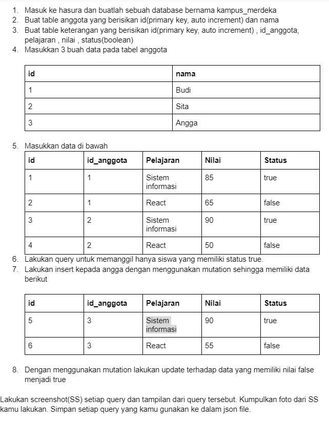
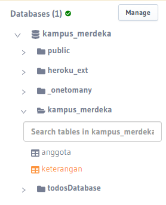
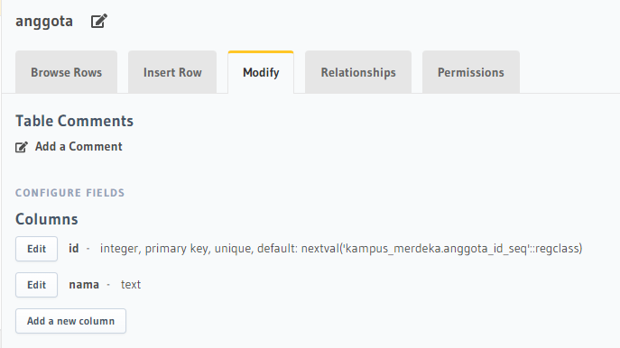
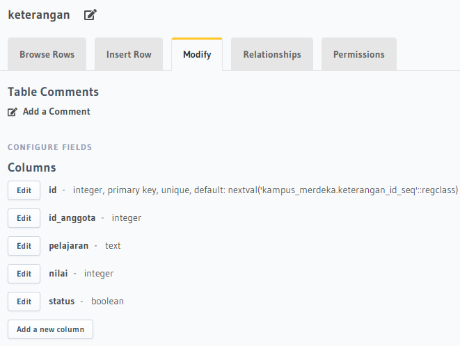
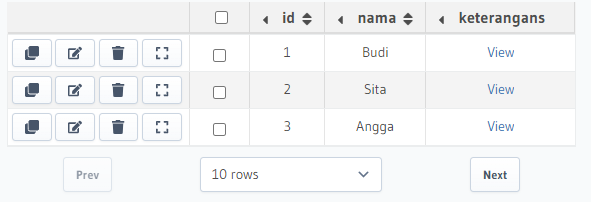
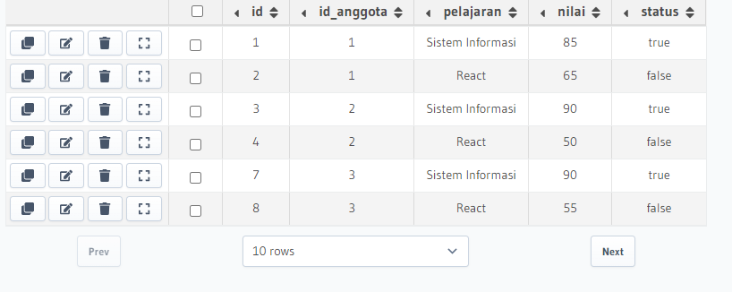
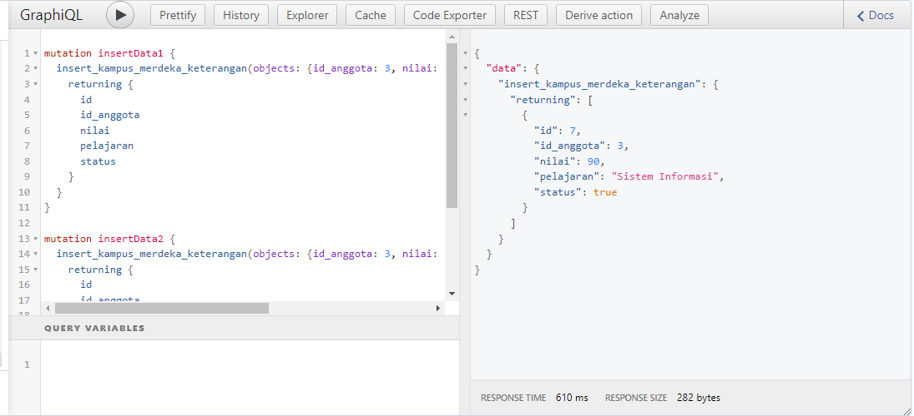
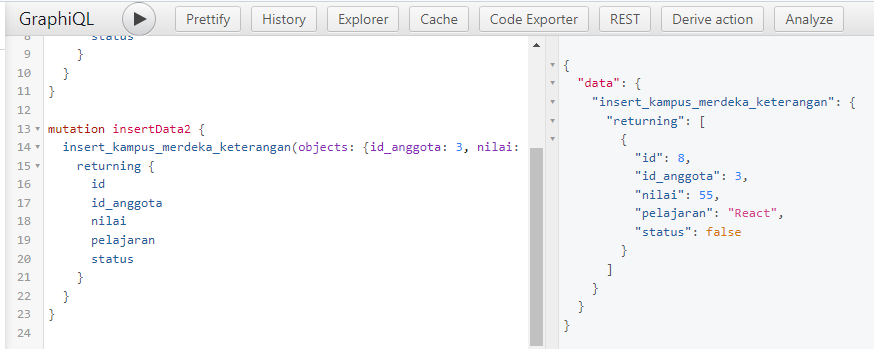
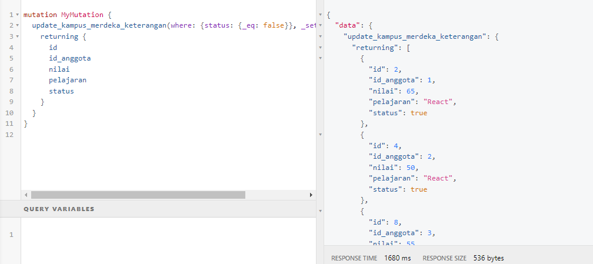

# 20 GraphQL - Basic
## Resume
Dalam materi ini, saya mempelajari:
1. GraphQL
2. Fitur Utama GraphQL
3. GraphQL pada Hasura

### 1. GraphQL
GraphQL itu adalah suatu query language untuk api kita, dimana kita bisa men-define skema dari data yang kita inginkan yang ingin kita kirim ke client dan kita bisa meminimize jumlah data, jadi client itu bisa memilih field apa saja yang kita butuhkan dan dengan graphQL kita cuman butuh satu endpoint aja.

### 2. Fitur Utama GraphQL
Dalam GraphQL terdapat 3 fitur utama yaitu:
1. Query, untuk mengambil data berdasarkan query spesifik yang kita berikan.
2. Mutation, insert, update, delete data.
3. Subscription, mendapatkan update date realtime / berdasarkan event.

### 3. GraphQL pada Hasura
Pada Hasura ini kita bisa membuat sebuah database lalu, kita bisa melakukan banyak dengan menggunakan GraphQL, ada pada Hasura seperti tempat postman, yaitu pengetesan dan pengambilan data, update data dan lain-lain dengan menggunakan graphql, kita bisa mengimplementasikan query, mutation dan subscription.

## Praktikum
Berikut adalah soal yang diberikan alterra.  
  

- Membuat database dengan nama kampus_merdeka.  
  

- Buat table anggota.  
  

- Buat table keterangan.  
  

- Memasukkan tiga data.  
  

- Memasukkan data keterangan.  

- Memasukkan insert mutation.  
  

- Mutation update nilai false jadi true.  
