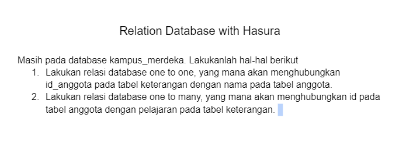
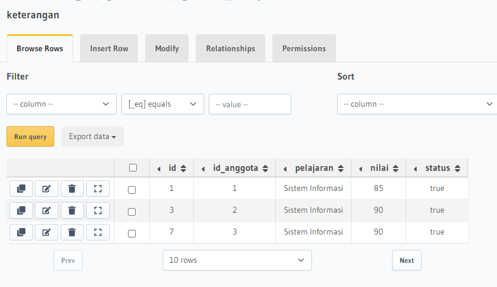
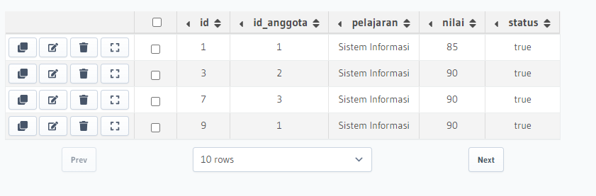

# 21 Relational Database
## Resume
Dalam materi ini, saya mempelajari:
1. Apa itu database.
2. Schema database.
3. Database relationship.

### 1. Apa itu database.
Database adalah sekumpulan data yang terorganisir, dimana data tersebut biasa dibagikan dalam berbagai tabel yang berisikan kumpulan data yang memiliki kunci unik untuk membedakan item 1 dan lainnya.

### 2. Schema database.
Schema database dapat di artikan sebagai bagaimana kita akan mendesign atau menstruktur database yang akan kita buat, misal punya ide untuk restoran, maka kita bisa menggambarkan database saat untuk mesin kasir, absensi karyawan, makanan yang di pesan dalam bentuk database dengan schema tertentu agar bisa berjalan dengan baik.

### 3. Database relationship.
Database relationship itu adalah sebuah hubungan entity dalam database misal dapat dicontohkan kita memliki suatu sistem database untuk twitter, dimana pada sebuah tweet data yang ditampilkan pada front-end itu merupakan kumpulan dari berbagai tabel-tabel yang sudah memiliki pk sendiri, dan memiliki yang namanya foreign key yang digunakan untuk merelasikan kedua tabel tersebut sehingga data menjadi lebih mudah diatur dan di mengerti.  
Dalam database terdapat tiga tipe relationship, yaitu one-to-one, one-to-many, dan many-to-many.
1. One-to-one relationship.  
One-to-one relationship adalah sebuah hubungan antara dua tabel, yang dimana keduanya hanya muncul sekali.

2. One-to-many relationship.  
One-to-many relationship adalah sebuah hubungan antara dua tabel, yang dimana satu tabel hanya muncul sekali sedangkan yang berhubungan muncul lebih dari satu kali.

3. Many-to-many.  
Many-to-many relationship merupakan hubungan antara dua tabel, dimana dua tabel dapat bermunculan lebih dari sekali, contoh misal tedapat data banyak mahasiswa berhubungan dengan banyak mata kuliah, dimana mata kuliah dapat diambil dari banyak mahasiswa.

## Praktikum
Berikut soal dari alterra.  
  

1. Jawaban dianggap one-to-one karena setiap 1 id anggota memiliki 1 ketereangan, dan setial keterengan memiliki 1 anggota, berikut table nya.  
  

2. Dan untuk ini memiliki satu anggota saja, tapi tiap anggota boleh memiliki 2 keterangan atau lebih maka dianggap one-to-many.  
