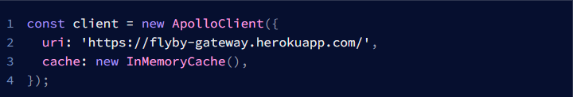
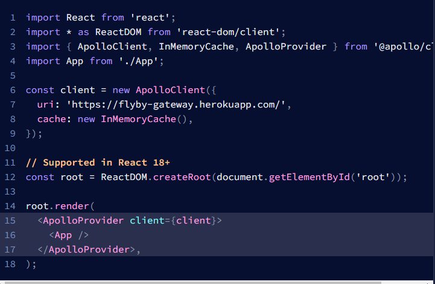
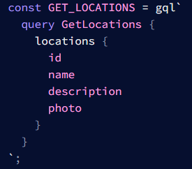
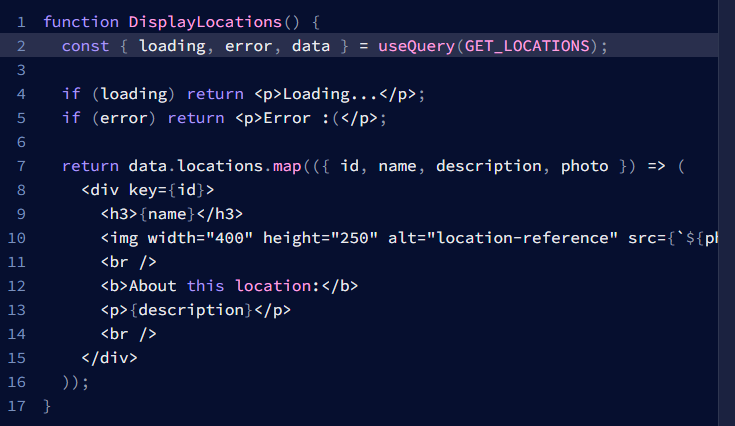

# 22 GraphQL - Query and Apollo Client
## Resume
Dalam materi ini, saya mempelajari:
1. Apollo.
2. Instalasi Apollo pada project React.
3. Instalasi Apollo client.
4. Penggunaan UseQuery Hook dari Apollo Client.

### 1. Apollo.
Apollo client adalah sebuah package yang digunakan oleh front-end pada projek react, dimana jika kita menggunakan REST kita biasa mendapatkan package axios dan lainnya, tetapi untuk apollo sendiri, lebih berfokus pada penggunaan GraphQL.

### 2. Instalasi Apollo pada project React.
Kita dapat menginstall dengan menggunakan terminal yang memiliki alamat di projek kita, cukup dituliskan sebuah command seperti berikut **npm install @apollo/client graphql**, maka dari itu kita sudah sukses menginstall apollo ini.

### 3. Instalasi Apollo client.
Kita dapat lakukan dengan mengimport ApolloClinet dari @apollo/client, dimana kita membuat sebauh variabel client yang nantinya akan berisikan URI graphQL, cache nya dan headers(Jika dibutuhkan), contoh dapat dilihat pada foto berikut.  
  
Ini nanti akan digunakan pada parameter dari ApolloProvider yang nanti akan dibungkus pada bagian file js utama, sebagai contoh dapat dilihat pada foto berikut.  

### 4. Penggunaan UseQuery Hook dari Apollo Client.
Kita dapat melakukan pemanggilan data dengan menggunakan sebuah query, dengan cara mengimport gpl dan useQuery dari package @apollo/client. Untuk caranya dapat dilihat pada foto berikut.  
Pertama kita membuat query untuk data yang ingin diambil.  
  

Lalu bisa dipanggil dengan cara berikut.  
.