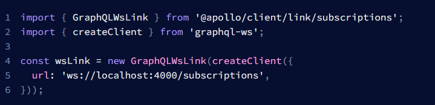
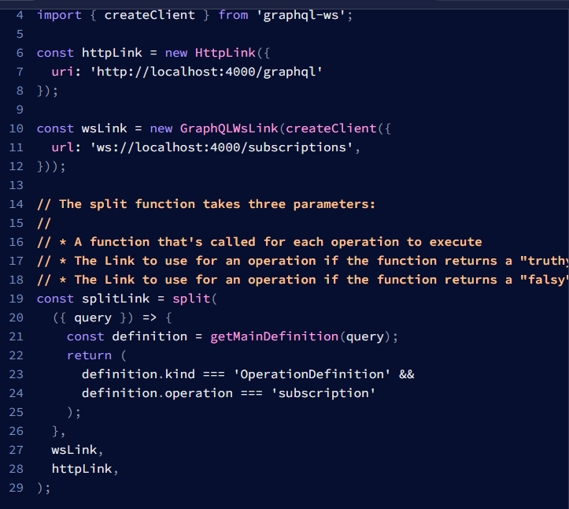
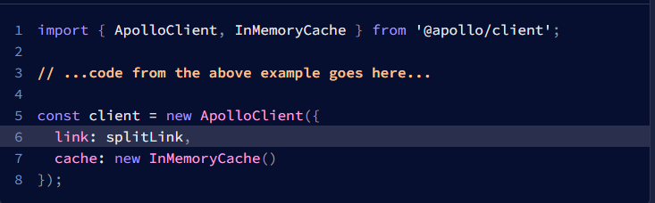

# 24 GraphQL Subscription
## Resume
Dalam materi ini saya mempelajari:
1. Subscription.
2. Penggunaan subscription pada Apollo di React

### 1. Subscription.
Subscription pada graphQL merupakan sebuah fitur graphQL dimana kita melakukan subscription pada data yang berada pada server, dimana jika data ada perbubahan, maka secara otomatis data akan di kirim ke pada web dan menjadi data pada web ataupun aplikasi yang mengimplementasikan graphQL menjadi up-to-data, tetapi pada Hasura data yang dikirimkan hanya lah data yang baru saja, sehingga sangat mudah untuk digunakan.

### 2. Penggunaan subscription pada Apollo di React
Dimulai dengan melakukan instalasi terlebih dahulu dengan memberikan command **npm install graphql-ws**, lalu membuat sebuah variabel yang memiliki WS link yang nanti link yang akan digunakan untuk melakukan subscription, contoh dapat dilihat pada foto berikut.  
  

Lalu dilakukan split, dimana disini kita melakukan split dari dua url yaitu untuk melakukan query, mutation, dan ada link dengan subscription, sehingga nanti jika sedang fetch dari subscription, yang lain tidak di run. Contoh dapat dilihat pada foto berikut.  
  

dan pada client, diganti dengan menggunakan parameter link pada ApolloClient, contoh dapat dilihat pada foto berikut.  

Dengan demikian kita akan bisa mengimplementasikan graphQL subscription dengan menggunakan hook useSubscription.